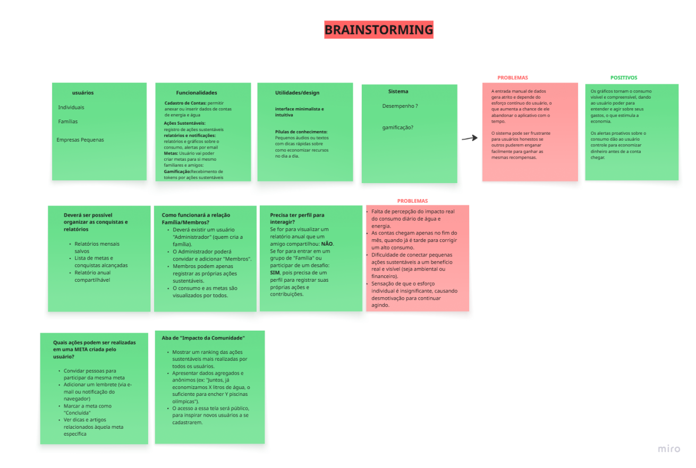

# Brainstorming

## Introdução
A tempestade de ideias, ou brainstorming, é uma dinâmica de equipe projetada para incentivar o fluxo espontâneo de conceitos, permitindo a análise de múltiplos pontos de vista em um ambiente livre de críticas. Essa ferramenta é comumente aplicada para gerar soluções criativas, resolver desafios pontuais e otimizar produtos ou serviços existentes. Conforme a literatura, um processo de ideação bem estruturado é capaz de desvendar as reais necessidades dos usuários, norteando aprimoramentos de grande impacto no design e na implementação de sistemas
Objetivos
Documentação e Centralização de Ideias:
Unificar e registrar formalmente os insights e propostas que surgiram ao longo das diferentes dinâmicas de ideação.

## Análise e Referência Futura:
Permitir a incorporação de percepções valiosas e garantir a atribuição correta dos créditos aos participantes e fontes consultadas nas etapas subsequentes do projeto.

## Fundamentação para a Tomada de Decisão:
Utilizar as contribuições coletadas como base para a especificação de requisitos e o desenvolvimento de novas funcionalidades.
Metodologia
As dinâmicas de ideação foram realizadas a partir de um método estruturado, visando potencializar tanto o pensamento criativo quanto a qualidade das propostas geradas. Cada sessão incentivou a quantidade sobre a qualidade em um primeiro momento, com o julgamento crítico sendo adiado para uma fase posterior de análise.

## Histórico de Versões

| Versão | Descrição                            | Autor(es)                                                                                         | Data       | Revisor(es)                                                                                                 | Data de Revisão |
| ------ | ------------------------------------ | ------------------------------------------------------------------------------------------------- | ---------- | ----------------------------------------------------------------------------------------------------------- | --------------- |
| 1.0    | Primeira versão do Brainstorming | [Davi Oliveira](https://github.com/daviRolvr), [Gustavo Gontijo](https://https://github.com/Guga301104) e [Ana Luiza Komatsu](https://https://github.com/luluaroeira) | 04/09/2025 | [Kaio Macedo](https://github.com/bigkaio) | 04/09/2025      |