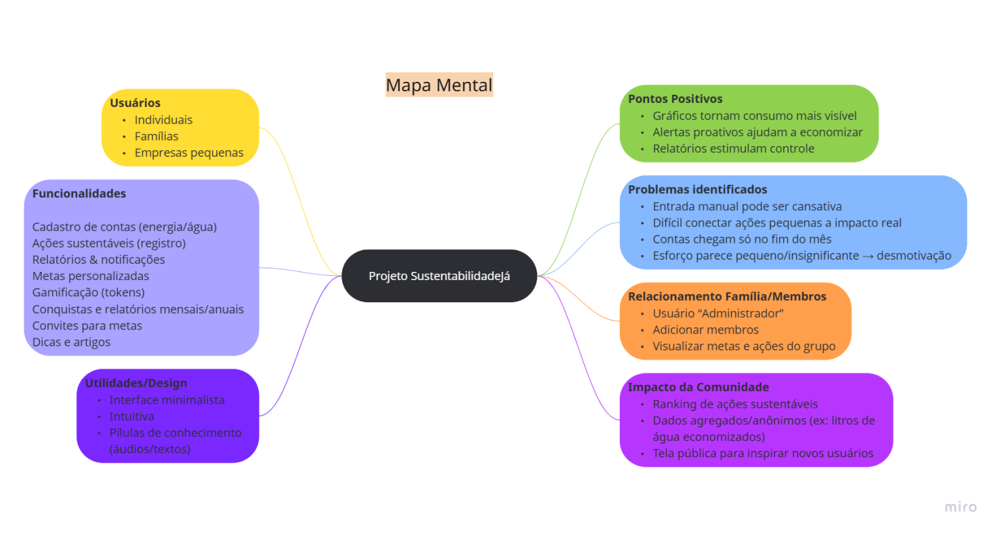

# Mapa Mental

## Introdução
O Mapa Mental é uma técnica de organização visual que auxilia no Design Sprint, pois transforma as ideias do brainstorm em uma estrutura clara e hierárquica. Ele foi elaborado pelo grupo a partir das discussões e reúne os principais pontos do projeto, como tipos de usuários, funcionalidades, problemas identificados, pontos positivos e impacto na comunidade. Dessa forma, o mapa mental conecta as etapas do Design Sprint, ajudando a validar requisitos e a alinhar a visão da equipe sobre o sistema.

## Metodologia
Como parte da metodologia adotada, o grupo realizou uma sessão de brainstorming em reunião virtual e, a partir dela, construiu um Mapa Mental para organizar e aprofundar as ideias levantadas. Esse processo permitiu estruturar de forma visual os pontos essenciais da futura aplicação, como usuários, funcionalidades, problemas, benefícios e impacto esperado. O resultado foi um mapa que sintetiza a essência do projeto e orienta o desenvolvimento do sistema. Toda a construção foi feita de forma colaborativa no aplicativo Miro, reforçando o alinhamento e a participação de todos os integrantes.

## Histórico de Versões

| Versão | Descrição                            | Autor(es)                                                                                         | Data       | Revisor(es)                                                                                                 | Data de Revisão |
| ------ | ------------------------------------ | ------------------------------------------------------------------------------------------------- | ---------- | ----------------------------------------------------------------------------------------------------------- | --------------- |
| 1.0    | Primeira versão do Mapa Mental | [Ana Luiza Komatsu](https://github.com/luluaroeira), [Gustavo Gontijo](https://https://github.com/Guga301104) e [Davi Oliveira](https://https://github.com/daviRolvr) | 04/09/2025 | [Gabriel Lopes](https://github.com/BrzGab) | 04/09/2025      |