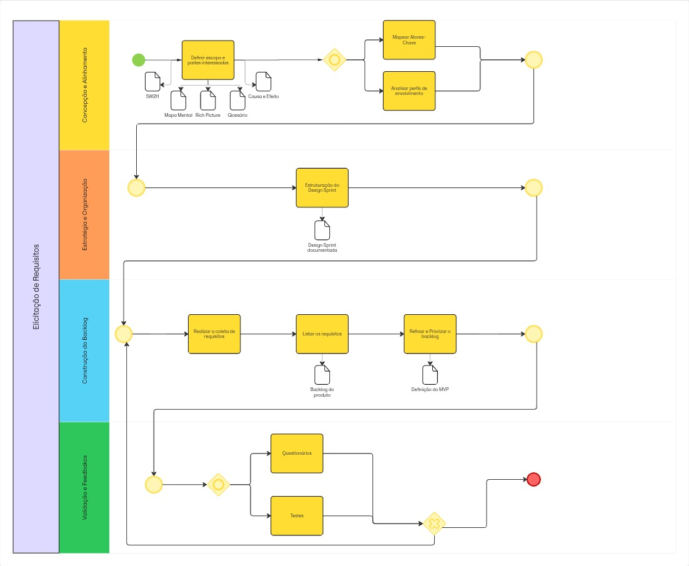
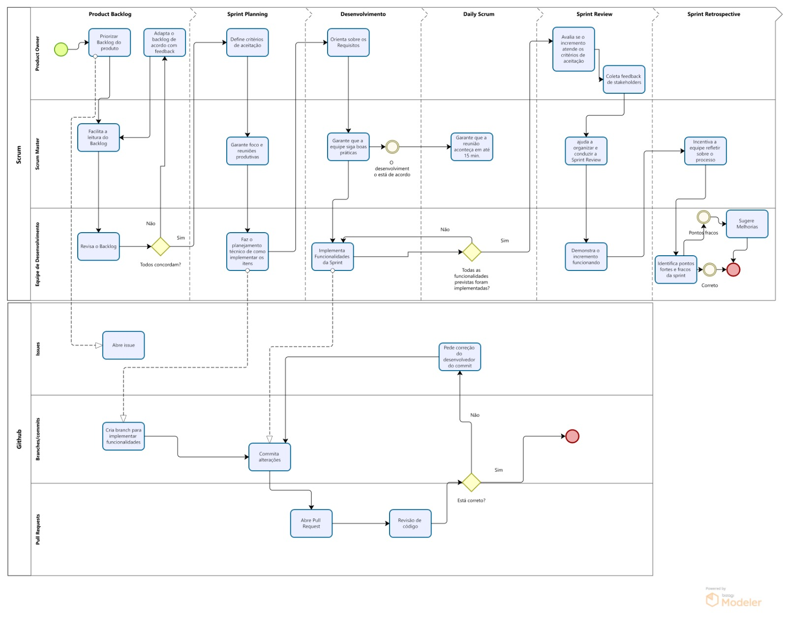

# Modelagem BPMN

## Introdução

A modelagem BPMN (Business Process Model and Notation) é uma representação gráfica para especificação de processos de negócio. Para o projeto SustentabilidadeJá, utilizaremos esta notação para mapear os principais fluxos de interação entre usuário e sistema, especialmente no processo de registro e validação de ações sustentáveis.

## Metodologia

Para a criação dos diagramas BPMN, seguimos as seguintes etapas:

1. Identificação dos principais processos do sistema
2. Mapeamento dos atores envolvidos
3. Definição do fluxo de atividades
4. Validação dos diagramas com a equipe
5. Refinamento com base no feedback

## Processos Principais

### 1. Registro de Ação Sustentável
Este processo engloba desde o momento em que o usuário decide registrar uma ação sustentável até sua validação e recompensa.

[Adicionar imagem do diagrama BPMN]

### 2. Elicitação de Requisitos
Essa fase demonstra o processo de elicitação de requisitos e construção do backlog.

*Fonte: [Gustavo Gontijo](https://github.com/Guga301104), [Davi Oliveira](https://github.com/daviRolvr), [Ana Luiza Komatsu](https://github.com/luluaroeira) 2025 - BPMN Elicitação de Requisitos v1.0*

### 3. Sistema de Recompensas
Fluxo que demonstra como os tokens são distribuídos e podem ser utilizados.

[Adicionar imagem do diagrama BPMN]

### BPMN da Metodologia Scrum (v1.0)
A primeira versão (v1.0) do BPMN da metodologia Scrum representa o fluxo da metodologia Scrum adotada no projeto, demonstrando as etapas desde o Product Backlog até a Sprint Retrospective, incluindo as atividades diárias e os pontos de decisão do processo.

*Fonte: [Artur Mendonça](https://github.com/ArtyMend07), 2025 - BPMN Metodologia v1.0*

O diagrama apresenta:
- O fluxo completo do Scrum
- As diferentes fases de uma sprint
- Os pontos de decisão e validação
- As atividades diárias da equipe
- Os eventos de retrospectiva

### BPMN da Metodologia Scrum (v2.0)
A segunda versão (v2.0) do BPMN da metodologia Scrum apresenta o fluxo da metodologia adotada no projeto, agora incluindo um pool do GitHub. Nesse pool, são exibidas as lâminas (lanes) de Issues, Branches/Commits e Pull Requests, mostrando como o modelo Scrum será aplicado pela equipe para organização e versionamento do código por meio do github.

*Fonte: [Lucas Mendonça Arruda](https://github.com/lucasarruda9), 2025 - BPMN Metodologia v2.0*

O diagrama agora apresenta:

- O controle de tarefas por meio das Issues
- O uso de Branches para a implementação de novas funcionalidades
- O uso de Pull Requests para revisão de código

### BPMN do Uso do Sistema (v1.0)

A primeira versão (v1.0) do BPMN do uso do sistema representa o fluxo completo de utilização do sistema, demonstrando desde a interação inicial do usuário até os processos de sustentabilidade e tokenização. O diagrama ilustra um processo integrado que engloba múltiplas camadas de funcionalidade e diferentes atores do sistema.

*Fonte: [Gabriel Lopes](https://github.com/BrzGab), 2025 - BPMN Uso do Sistema v1.0*

O diagrama apresenta quatro principais processos que organizam as responsabilidades e fluxos:

**Usuário Final:** Representa o ponto de entrada do sistema, onde o usuário acessa o site e realiza ações que desencadeiam todo o processo subsequente. Esta camada inclui o registro de dados de cadastro e o envio de informações para processamento.

**Cadastro e Login:** Gerencia a autenticação e autorização do usuário, incluindo processos de escolha de tipo de pedido, tratamento de transporte, reciclagem e descarte de materiais. Esta seção incorpora decisões críticas sobre o tipo de ação a ser executada e a conversão de ações em dados estruturados.

**Sistema Sustentabilidade e Monitoramento de Consumo:** Processa os dados relacionados às práticas sustentáveis, calculando diferenças de impacto ambiental e gerenciando solicitações de tokens de sustentabilidade. Este módulo é responsável por avaliar e quantificar as ações ambientalmente conscientes dos usuários.

**Ações Sustentáveis e Sistema de Tokens:** Finaliza o processo com o registro de ações sustentáveis, validação de fotos comprobatórias e a distribuição de tokens como recompensa pelas práticas ambientalmente responsáveis. Inclui também o processamento de recebimento de solicitação de tokens.

O fluxo demonstra um sistema integrado que incentiva práticas sustentáveis através de um mecanismo de recompensas tokenizadas, criando um ciclo virtuoso de engajamento ambiental e reconhecimento das ações dos usuários.

## Ferramentas Utilizadas
- Miro

## Bibliografia
- [Documentação oficial BPMN 2.0](https://www.omg.org/spec/BPMN/2.0/)
- [Material da disciplina - Arquitetura e Desenho de Software](https://aprender3.unb.br/pluginfile.php/3178527/mod_page/content/2/Arquitetura%20e%20Desenho%20de%20software%20-%20Aula%20BPMN%20Exemplos%20-%20Profa.%20Milene.pdf)

## Histórico de Versões

| Versão | Data | Descrição | Autor | Revisor | Data da Revisão |
|--------|------|-----------|--------|---------|-----------------|
| 1.0 | 03/09/2025 | Estrutura inicial do documento da modelagem BPMN | [Artur Mendonça](https://github.com/ArtyMend07) | [Lucas Mendonça](https://github.com/lucasarruda9) | 03/09/2025 |
| 1.1 | 04/09/2025 | Adição do BPMN da metodologia Scrum | [Artur Mendonça](https://github.com/ArtyMend07) | [Lucas Mendonça](https://github.com/lucasarruda9) | 04/09/2025 |
| 1.2 | 04/09/2025 | Adição do BPMN do Uso do Sistema | [Gabriel Lopes](https://github.com/BrzGab) | [Lucas Mendonça](https://github.com/lucasarruda9) | 04/09/2025 |
| 1.3 | 04/09/2025 | Adição do BPMN do Elicitação de Requisitos | [Gustavo Gontijo](https://github.com/Guga301104) | [Davi Oliveira](https://github.com/daviRolvr), [Ana Luiza Komatsu](https://github.com/luluaroeira) | 04/09/2025 |
| 1.4 | 04/09/2025 | Adição do BPMN da metodologia Scrum Versão 2 | [Lucas Mendonça](https://github.com/lucasarruda9) | [Artur Mendonça](https://github.com/ArtyMend07) | 04/09/2025 |
