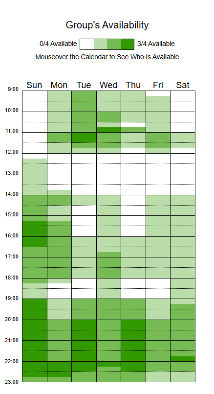

# Análise do Heat Map de Disponibilidade — SustentabilidadeJá

## Introdução

Este documento analisa o **heat map de disponibilidade** do grupo do projeto **SustentabilidadeJá**. O objetivo é:

- descrever padrões visíveis na distribuição de horários;
- identificar intervalos que concentram maior presença de integrantes;

---

## Heat map

  
*Figura — Heat map de disponibilidade do grupo (fonte: When2Meet).*

Fonte: [Artur Mendonça](https://github.com/ArtyMend07), 2025 - HeatMap v1.0

---

## Legenda

A escala de cores do When2Meet indica maior ou menor quantidade de pessoas disponíveis:

- **Branco / tons muito claros** → disponibilidade mínima ou nula  
- **Verde claro** → baixa a moderada disponibilidade  
- **Verde médio** → número razoável de pessoas disponíveis  
- **Verde escuro** → alta concentração de pessoas  
- **Verde muito escuro / saturado** → quase todos disponíveis

---

## Observações finais

- O heat map mostra que o período **noturno, especialmente entre 20h e 22h**, concentra maior disponibilidade, repetindo-se em diversos dias da semana.  
- Horários da **tarde (16h–18h)** aparecem como alternativa viável em alguns dias, embora com menos consistência.  
- Manhãs e início da tarde apresentam baixa adesão, o que os torna pouco recomendados para encontros amplos.  
- A recomendação é **priorizar o horário noturno** para reuniões gerais e manter um horário alternativo à tarde para casos específicos.  
- Sugere-se confirmar esses intervalos com o grupo antes de formalizar a agenda.

---

## Referência

- When2Meet — ferramenta usada para coleta de disponibilidades. Disponível em: <https://www.when2meet.com/>.  
  *Acesso em: [04/09/2025]*

---

## Histórico de versões

| Versão | Data | Descrição | Autor | Revisor | Data da Revisão |
|--------|------|-----------|--------|---------|-----------------|
| 1.0 | 04/09/2025 | Estrutura inicial do documento do heat map | [Artur Mendonça](https://github.com/ArtyMend07) | [Lucas Mendonça](https://github.com/lucasarruda9) | 04/09/2025 |
